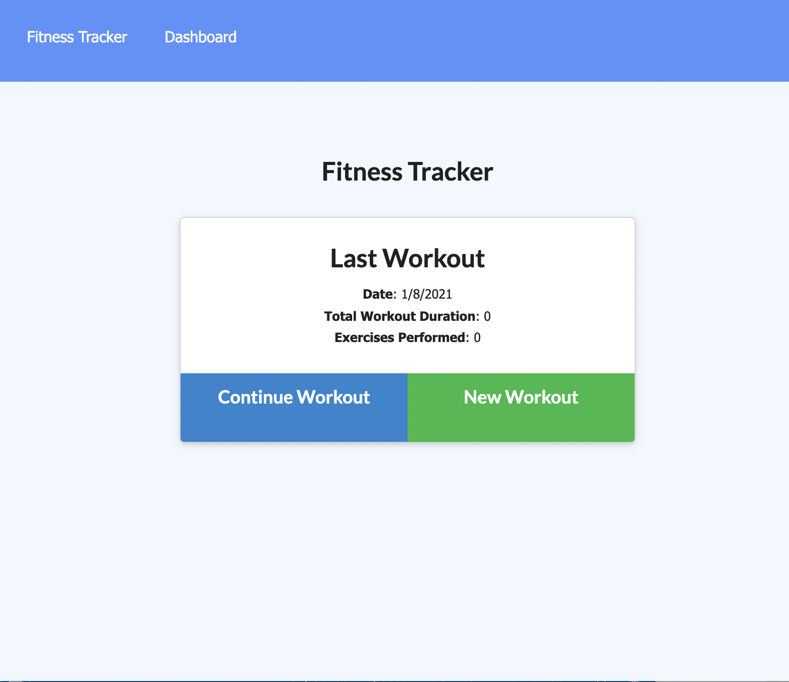
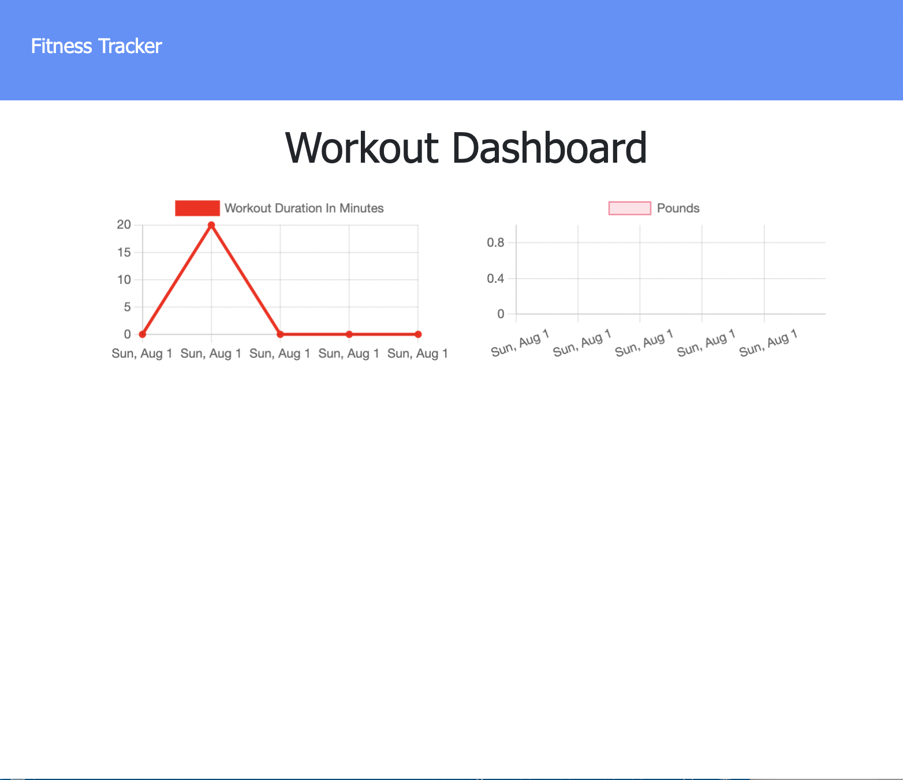

# WorkoutTracker

 ## Table of contents
  * [Description](#Description)
  * [Technologies](#Technologies)
  * [Installation](#Installation)
  * [Usage](#Usage)
  * [Link](#Link)

  ## Description
  ```
  Creates and tracks daily workouts. The user is able to view and add multiple exercises in a workout on a given day.
  ```

  ##  Technologies
  Javascript
  Html
  CSS
  Package json
  MongoDB Atlas

  ## Installation
  ```
  Clone it from Github on the desired personal computer
  Click on the deployed application
  ```

  ## Usage
  This application is great for a person that spend time at the gym that wants to keep track of each exercise as well as its progress
  
  
  
  
  ## Link
  https://desolate-eyrie-51645.herokuapp.com/
  https://github.com/Sofiacrf/WorkoutTracker.git
  
  ## Author
  Sofia Rojas sofiacrf@github.com